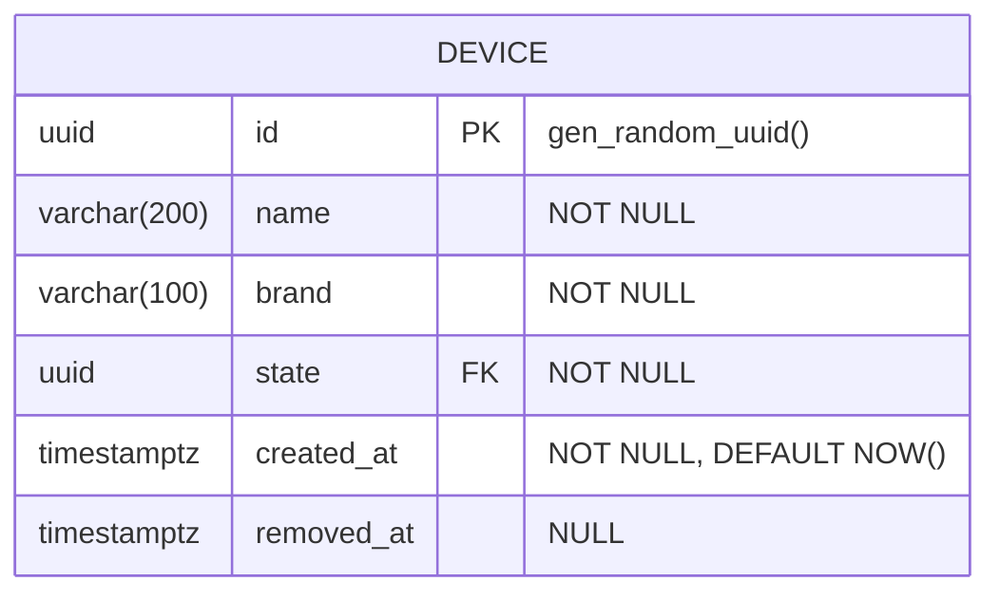
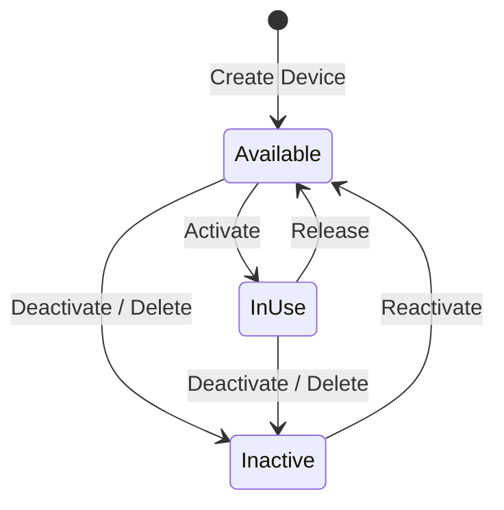

# Devices API Gateway

THIS IS JUST A INTERVIEW CHALLENGE. TAKE EVERYTHING HERE WITH A GRAIN OF SALT

The Devices service is an API Gateway which provides endpoints for managing devices. 

The goal of this microservice is to be secure, scalable, efficient, and traceable, while maintaining a good implementation of a REST API and Domain Driven Design

---

- [Devices API Gateway](#devices-api-gateway)
  - [Tech Stack](#tech-stack)
  - [Architecture / Patterns](#architecture--patterns)
  - [Architecture Decisions](#architecture-decisions)
  - [AI Usages:](#ai-usages)
  - [DB Design](#db-design)
    - [Entity Relationship Diagram](#entity-relationship-diagram)
    - [State Diagram](#state-diagram)
  - [Running Locally](#running-locally)
    - [Prerequisites](#prerequisites)
    - [1. Start infrastructure containers](#1-start-infrastructure-containers)
    - [2. Apply database migrations](#2-apply-database-migrations)
    - [3. Run the API](#3-run-the-api)
    - [4. Stop infrastructure](#4-stop-infrastructure)
    - [Running everything in Docker](#running-everything-in-docker)
  - [TODO](#todo)


## Tech Stack
- Framework: .NET 9
- DB: PostgreSQL
- Caching: Redis
- Input Validation: FluentValidation
- Domain Validation: Rich Domain Model
- Mapping: Mapperly
- Repos: EF Core
- Logging: Serilog
- Sink: Console
- Package Manager: Nugget
- Scalability: Dockerfile / Helm / K8s

## Architecture / Patterns
- Clean Architecture / DDD
  - Devices.Api
  - Devices.Application
  - Devices.Domain
  - Devices.Infrastructure
- CQRS Pattern
- REST API with support for RFC 7807 Problem Details

## Architecture Decisions
In order to have a fully functional microservice while simulating a high load environment, I decided to adopt the following architecture decisions:

- Use EF instead of Dapper, as the more recent versions of EF Core have improved drastically the performance and seems to be on par with Dapper, while still allowing to have a more maintainable codebase and avoiding the pitfalls of manually writing SQL queries.
- Use Serilog with a Console sink, as it's a more common practice in microservices, and allows to easily integrate with log aggregation tools like ELK or Grafana Loki, while still allowing to have a good logging experience during development and local testing.
- Use Mapperly instead of AutoMapper, as it's a source generator and allows to have a better performance and less memory allocation, while still providing a good mapping experience and avoiding the pitfalls of reflection-based mappers.
- Use FluentValidation for input validation, as it's a well established library with a good community and allows to have a clean and maintainable validation logic, while still providing a good experience for defining validation rules and error messages.
- Use a rich domain model for domain validation, as it allows to have a better separation of concerns and a more DDD approach

- Use RFC 7807 Problem Details for error handling, as it's the standard way to represent errors in a REST API and allows to have a consistent and structured error response
- Use the Results pattern for handling the outcome of business operations, as it allows to have a clear and consistent way to represent success and failure cases, while avoiding increased memory allocation and processing time that comes with exceptions. In this way, we also give space to use Exceptions for truly exceptional cases, such as infrastructure failures or unexpected errors.

- Use the Clean Architecture in conjunction with DDD as it allows to have a clear separation of concerns, a increased maintainability and scalability of the codebase, and a better testability of the business logic
- Use CQRS pattern to structure the service, as it allows to have a clear separation between read and write operations, increased scalability, and a better maintainability of the codebase

## AI Usages
- Automated Code Review
- Some boilerplate code generation (the ones generated by AI are documented as so)
- Tests Generation
- Rubber duck

## DB Design

### Entity Relationship Diagram



### State Diagram
State diagram for a simplified device lifecycle. This was done with a base of a AI suggestion and reviewed and modified by me.


## Running Locally

### Prerequisites
- [.NET 9 SDK](https://dotnet.microsoft.com/download/dotnet/9.0)
- [Docker](https://www.docker.com/products/docker-desktop) (for PostgreSQL, OTEL Collector, and Jaeger)

Restore local .NET tools (includes EF Core CLI):

```bash
dotnet tool restore
```

### 1. Start infrastructure containers

Start PostgreSQL, the OpenTelemetry Collector, and Jaeger using the infrastructure-only compose file:

```bash
docker compose -f docker-compose.infra.yaml up -d
```

| Service | Host Port | Purpose |
|---|---|---|
| **PostgreSQL** | `localhost:5432` | Database (`devicemanager`, user: `admin`, password: `password123`) |
| **OTEL Collector** | `localhost:4317` | Receives traces & metrics from the API via gRPC |
| **Jaeger UI** | `localhost:16686` | Tracing visualization |

### 2. Apply database migrations

Run EF Core migrations to create the schema:

```bash
dotnet ef database update \
  --project src/DeviceGateway.Infrastructure \
  --startup-project src/DeviceGateway.Api
```

To create a new migration after model changes:

```bash
dotnet ef migrations add <MigrationName> \
  --project src/DeviceGateway.Infrastructure \
  --startup-project src/DeviceGateway.Api
```

### 3. Run the API

```bash
dotnet run --project src/DeviceGateway.Api
```

The API starts at **http://localhost:5006**.

- **Swagger UI**: http://localhost:5006/swagger
- **Jaeger UI**: http://localhost:16686

### 4. Stop infrastructure

```bash
docker compose -f docker-compose.infra.yaml down
```

Add `-v` to also remove the PostgreSQL data volume:

```bash
docker compose -f docker-compose.infra.yaml down -v
```

### Running everything in Docker

To run the API together with the infrastructure (no local .NET SDK required):

```bash
docker compose up --build
```

The API will be available at **http://localhost:6666**.

## TODO
- Add Authentication and Authorization
- Add tests. I've used AI here to generate some of the simple tests, but I wanted to create the bare bones of the tests projects by myself, so I left without it.
- Implement remaining domain entities and domain validation
- Implement remaining endpoints, and CQRS handlers
- Add Redis caching layer
- Add JWT Authentication
- Add XML doc comments and documentation
- Initialize the DB
- Performance testing and optimization
- Use a Vault for secrets management instead of hardcoding credentials